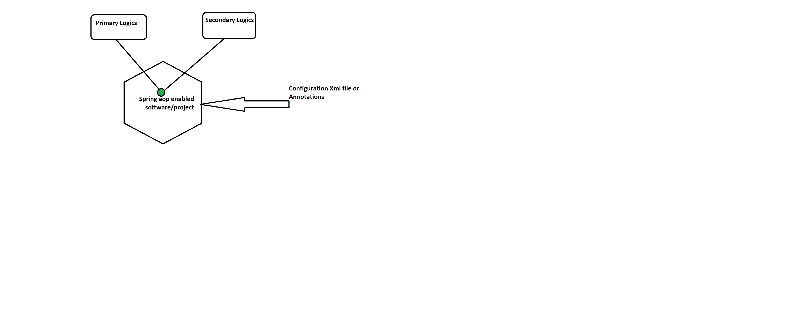
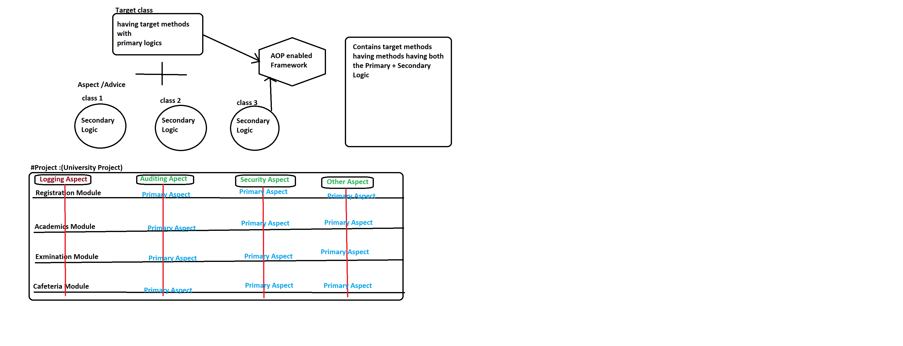

# Spring AOP: Aspect-Oriented Programming

## What is AOP?

- **AOP** (Aspect-Oriented Programming) is not meant to compete with OOP (Object-Oriented Programming). 
- Instead, it complements OOP by addressing the limitations of OOP in certain scenarios.
- AOP is a methodology to solve problems related to OOP by providing an additional abstraction layer on top of OOP.

## Primary and Secondary Logic in AOP

- **Primary Logic**: These are the core, mandatory logics that are required for the task or activity in your application. For example:
  - Transfer money logic
  - Withdraw money logic
  - Check account balance logic
  - Closing account logic
  - KYC verification logic
  - Change transaction password logic

- **Secondary Logic**: These are optional, configurable logics that can be enabled or disabled according to requirements. For example:
  - Auditing
  - Logging
  - Transaction management
  - Security
  - Performance monitoring

### In OOP Style

In the OOP approach, the service methods or business methods of a class contain both primary and secondary logic together, which leads to the following challenges:

### Example of Mixed Primary and Secondary Logic:

```java
public class BankServiceImpl implements BankService {

    public String withdraw(String accNo, float withdrawAmount) {
        // Secondary logics
        // Security logics (Authentication + Authorization)
        // Logging
        // Auditing

        // Primary logic
        if (accBalance < withdrawAmount) {
            System.out.println("Insufficient funds..");
        } else {
            // Withdraw logic
            accBalance = accBalance - withdrawAmount;
        }

        return "Withdraw successfully";
    }

    public String deposit(String accNo, float depositAmount) {
        // Secondary logics
        // Security logics (Authentication + Authorization)
        // Logging
        // Auditing

        // Primary logic
        if (accBalance < depositAmount) {
            System.out.println("Insufficient funds..");
        } else {
            // Deposit logic
            accBalance = accBalance + depositAmount;
        }

        return "Deposit successfully";
    }
}
```
- Note :: Secondary logic are called middleware service or aspects or cross cutting concerns

## Limitations of OOP Style Programming

1. **Code becomes very clumsy** because it contains both primary and secondary logics mixed together.
2. **No reusability** of secondary logic can be achieved (kills modularity).
3. **Reduces readability** of the code.
4. **Debugging becomes very tough**.
5. **We cannot disable or enable the secondary logic** by our choice without touching the source code.
6. This style **does not suit very complex medium-scale apps or large-scale applications** (this is not an industry standard).

## Solution: AOP (Aspect-Oriented Programming)

To overcome the above problems, **AOP** programming can be used. It suggests:

- **Separate secondary logic from primary logic** at the time of application/project development.
- **Mix them together dynamically at runtime** as needed.

AOP is supported by frameworks such as:
- Spring AOP
- AspectJ AOP
- JBoss AOP
- and others.

### Here is a list of various **Aspect-Oriented Programming (AOP) implementations** apart from AspectJ:  

### **1. Spring AOP**  
   - A subset of AspectJ, built into Spring Framework.  
   - Uses dynamic proxies (JDK or CGLIB).  
   - Supports method-level interception using annotations (`@Aspect`).  
   - Does **not** support field-level or constructor interception.  

### **2. JBoss AOP** (Deprecated)  
   - Provided by JBoss, supported full AspectJ-like weaving.  
   - Allowed class, field, and method-level weaving.  
   - Used XML-based and annotation-driven configuration.  
   - Discontinued after JBoss shifted focus to CDI and Interceptors.  

### **3. Guice AOP** (Google Guice)  
   - Part of the Guice dependency injection framework.  
   - Uses method interception via `MethodInterceptor` and `@AOP` bindings.  
   - Proxy-based, similar to Spring AOP.  

### **4. CDI Interceptors (Java EE / Jakarta EE)**  
   - Built-in AOP mechanism in Java EE / Jakarta EE.  
   - Uses `@Interceptor` and `@InterceptorBinding` annotations.  
   - Works at method level (similar to Spring AOP).  
   - Requires enabling interceptors in `beans.xml`.  

### **5. Dynaop** (Dynamic AOP)  
   - Lightweight AOP framework that uses dynamic proxies.  
   - Allows runtime AOP without modifying bytecode.  
   - Lesser known and not widely maintained.  

### **6. Javassist AOP**  
   - Uses **Javassist** bytecode manipulation library.  
   - Allows modifying class bytecode dynamically at runtime.  
   - Used in frameworks like Hibernate and WildFly.  

### **7. Proxy-based AOP in Java**  
   - Uses JDK dynamic proxies (`java.lang.reflect.Proxy`).  
   - Allows runtime method interception.  
   - More manual, requires writing custom `InvocationHandler`.  
   
   
# Advantages of AOP Style Programming

1. **Code is not clumsy** because both the primary logics and secondary logics are separated.
2. **Improves the readability** of the code.
3. **Improves the modularity**.
4. You can **enable or disable the secondary logic** because secondary logic is separated without affecting the primary logics.
5. **AOP style programming is an industry standard** nowadays.
6. **Debugging becomes easier**.

## AOP Enabled Frameworks/Technologies

The frameworks/technologies that are based on the Aspect-Oriented Programming principles are called AOP-enabled frameworks/technologies/software. Examples include:

- Spring AOP
- AspectJ AOP
- JBoss AOP

**Note:** Spring Framework provides support for both Spring AOP and AspectJ AOP.

---

# AOP Principles or Terminologies

1. **Aspect**
2. **Advice**
3. **JoinPoint**
4. **PointCut**
5. **Target Class**
6. **Weaving**
7. **Proxy Class**

---

## 1. Aspect (What you want to apply)

- It is the class that represents secondary logics. This is also called **middle service** or **cross-cutting concerns**.

---

## 2. Advice (How you want to apply)

- The action taken by the aspect is called **Advice**. For any aspect, if we specify how it should be executed or behave, then it is called Advice.
- **Aspect** contains secondary logic, whereas **Advice** contains secondary logic with an action plan.

### Types of Advice:

1. **Before Advice**: Executes before entering into the business method/target method of the target class.
2. **After Advice**: Executes after the completion of execution of the target method of the target class.
3. **Around Advice**: Executes before and after the target method/business method execution.
4. **Throws Advice**: Executes only when an exception is raised in the target method/business method.

---

## 3. JoinPoint (Where you can apply)

- The possible places in the target class where these aspects can be advised. These places can be fields (variables), constructors, methods, etc. These places are called **JoinPoints**.
- **Spring AOP** supports only methods as JoinPoints.
- If the target class has 20 business methods, then there are 20 JoinPoints.

---

## 4. PointCut (Collection of method names where we have applied or want to apply the aspect or advice)

- A collection of JoinPoints where the aspects are advised (i.e., PointCut holds the set of business methods or target method names belonging to the target class to apply aspects/advice).
- If the target class has 20 business methods, then there are 20 JoinPoints. But if we want to apply aspect/advice to only 10 methods, then this group of 10 method names is called 1 PointCut.

---

## 5. Target Class

- The class that contains business methods or target methods having primary logics is called the **Target Class**.
- This target class will have JoinPoints.PreAOP class is called target class

---

## 6. Weaving

- The process of applying or mixing up secondary logics with primary logics and generating the **In-Memory Proxy Class** is called **Weaving**.
- AOP-enabled software performs this weaving process.
- The inputs for the weaving process are: **Target Class**, **Aspect/Advice Classes**, and the outcome of the weaving process is the **In-Memory Proxy Class**.

---

## 7. Proxy Class

- The outcome of weaving done by the Spring AOP-enabled framework is called the **Proxy Class**.
- This Proxy Class in the Spring AOP project is always an **In-Memory Generated Proxy Class**.
- The **Post-AOP Class** is called the **Proxy Class**.

## Note:

- If you call a business method on the **Target Class**, then only the **primary logic** will be executed.
- If you call a business method on the **In-Memory Generated Proxy Class**, then both the **secondary** and **primary logics** will be executed.



---

## Realtime Project Development:

- In real-time project development, **secondary logics** are **verticals**, and **primary logics** are **horizontals**.
- The **secondary logics** are developed **once** and are applied to **multiple primary logics** as **cross-cutting concerns** or **middleware services**.

